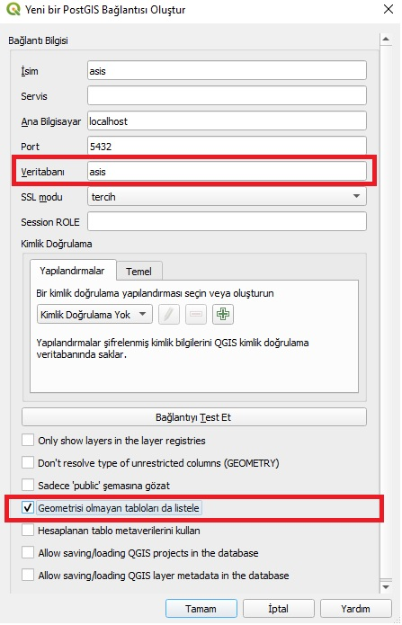
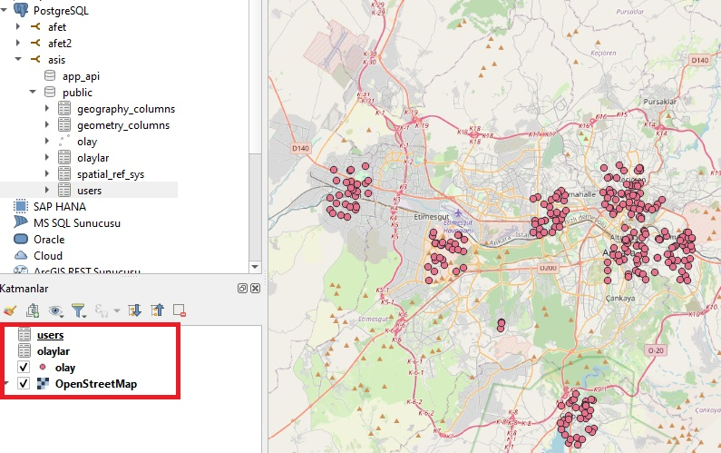
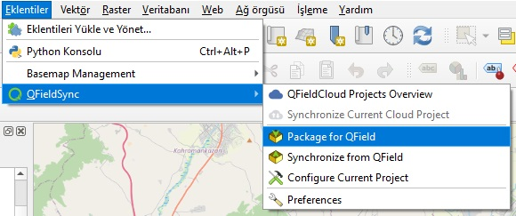
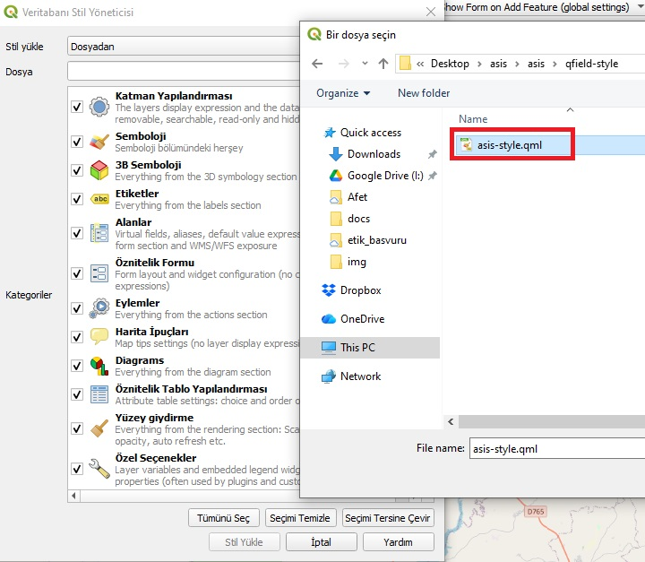
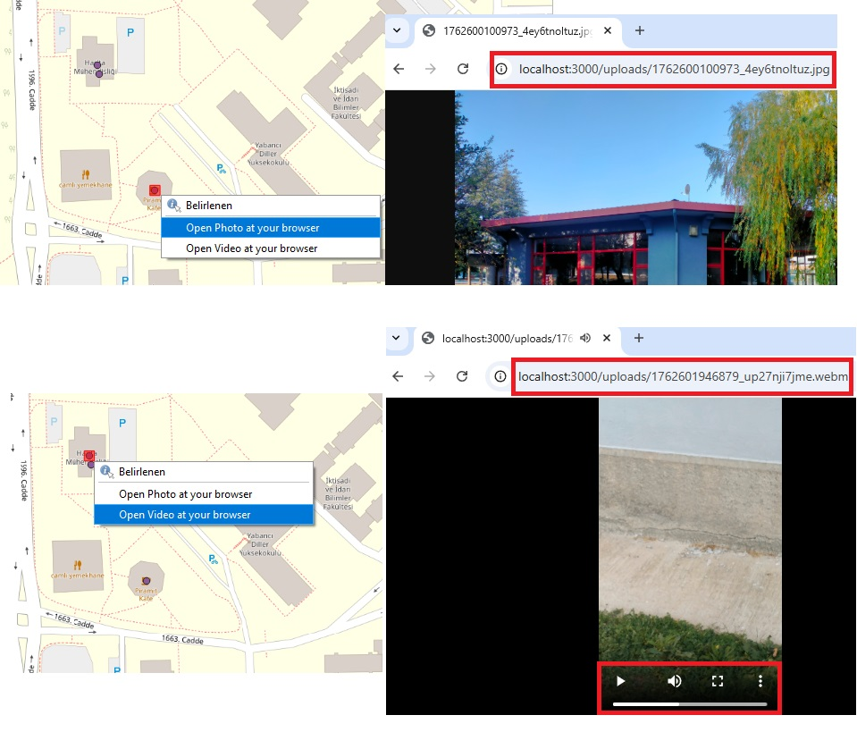
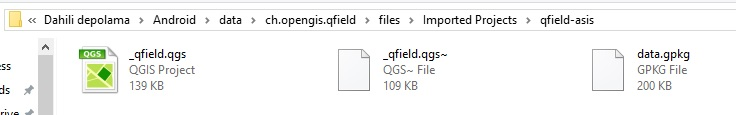
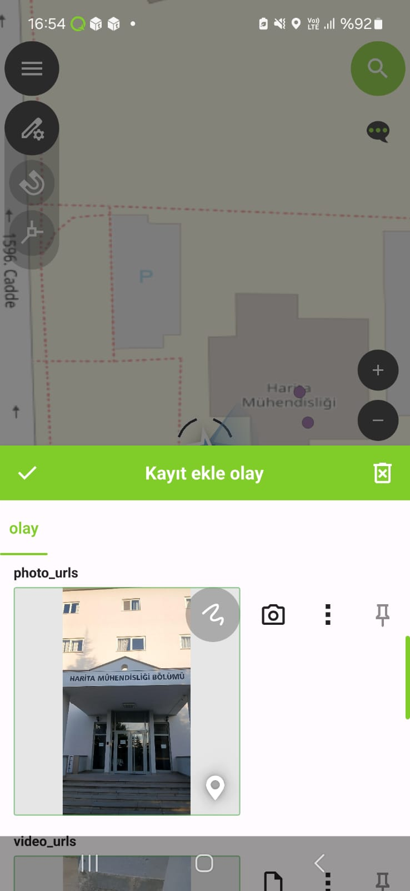
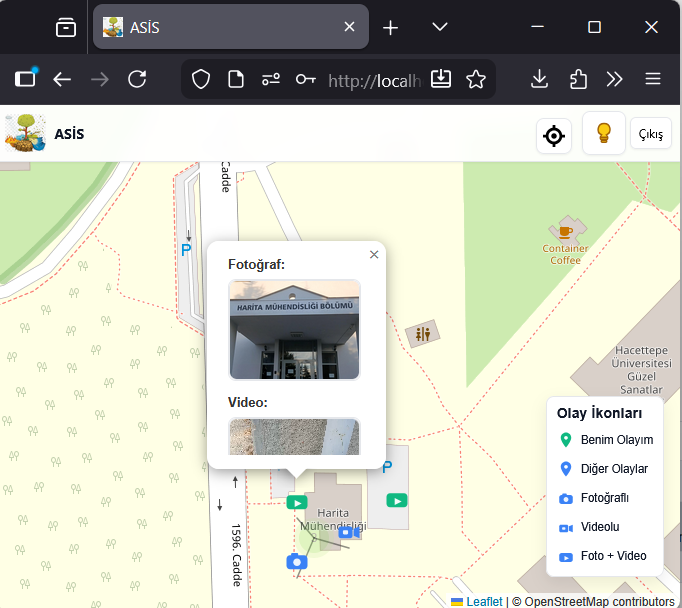

# ASİS - Afet Sonrası İzleme Sistemi

<div align="center">


[](https://www.gnu.org/licenses/gpl-3.0)
[](https://nodejs.org/)
[](https://www.postgresql.org/)
[](https://qgis.org/)
[](https://getbootstrap.com/)

**Afet durumlarında vatandaşların ve ekiplerin konum bazlı olay bildirimi yapabildiği, hem web hem de mobil (QField) üzerinden offline çalışabilen, yöneticilerin bu bildirimleri takip edebildiği PostgreSQL tabanlı açık kaynak izleme ve raporlama platformu.**

[Özellikler](#-özellikler) •
[Kurulum](#-kurulum) •
[QField Entegrasyonu](#-qfield-entegrasyonu-offline-veri-toplama) •
[Kullanım](#-kullanım) •


</div>

---

## İçindekiler

- [Özellikler](#-özellikler)
- [Teknolojiler](#-teknolojiler)
- [Sistem Gereksinimleri](#-sistem-gereksinimleri)
- [Kurulum](#-kurulum)
  - [Web Uygulaması Kurulumu](#1-web-uygulaması-kurulumu)
  - [.env Dosyası Yapılandırması](#2-env-dosyası-yapılandırması)
- [QField Entegrasyonu](#-qfield-entegrasyonu-offline-veri-toplama)
- [Kullanım](#-kullanım)
- [Proje Yapısı](#-proje-yapısı)


---

##  Özellikler

### Web Uygulaması Özellikleri

#### Harita Tabanlı Olay Yönetimi
- **Leaflet.js** kullanarak interaktif harita görünümü
- Harita üzerinde tıklayarak veya canlı konum kullanarak olay bildirimi
- Marker kümeleme (clustering) ile performanslı görüntüleme
- Özelleştirilebilir harita başlangıç konumu ve zoom seviyeleri
- Çoklu harita görünümü (kullanıcı haritası + admin/supervisor haritası)

#### Multimedya Yönetimi
- Fotoğraf ve video yükleme desteği
- Kamera ile doğrudan fotoğraf çekme (Web API)
- Video kaydetme özelliği (MediaRecorder API)
- Lightbox ile tam ekran medya görüntüleme
- QField'dan gelen fotoğraf ve videoların otomatik format dönüşümü

#### Gelişmiş Veri Girişi
- Web Speech API ile sesli açıklama ekleme
- Türkçe dil desteği
- Gerçek zamanlı konuşma tanıma

#### Rol Tabanlı Yetkilendirme
- **User (Vatandaş)**: Olay bildirimi, kendi olaylarını düzenleme
- **Supervisor (Gözlemci)**: Tüm olayları görüntüleme, kendi eklediği türleri yönetme, kullanıcı yönetimi
- **Admin (Yönetici)**: Tam sistem kontrolü, tüm yönetim yetkileri

####  Gelişmiş Filtreleme ve Analiz
- Tarih bazlı filtreleme (özel tarih aralıkları, sıralama)
- E-posta domain bazlı filtreleme
- Olay türü filtreleme (faydalı/faydasız)
- Kullanıcı bazlı filtreleme
- GeoJSON export özelliği

####  Güvenlik
- JWT token bazlı kimlik doğrulama
- İki faktörlü kimlik doğrulama (2FA/TOTP)
- E-posta doğrulama sistemi
- bcrypt ile şifre hashleme
- XSS ve SQL injection koruması

#### Kullanıcı Deneyimi
- Koyu/Açık tema desteği
- Responsive tasarım (mobil uyumlu)
- PWA (Progressive Web App) desteği potansiyeli
- Türkçe arayüz

### QField (Offline) Özellikleri

####  Mobil Veri Toplama
- **QField** mobil uygulaması ile offline veri toplama
- GPS ile otomatik konum bilgisi
- Fotoğraf ve video ekleme
- Form tabanlı veri girişi
- Özelleştirilebilir widget'lar

####  Senkronizasyon
- QGIS QFieldSync plugin ile otomatik senkronizasyon
- Offline toplanan verilerin PostgreSQL veritabanına aktarımı
- Medya dosyalarının otomatik format dönüşümü
- Çift yönlü veri senkronizasyonu

#### QGIS Entegrasyonu
- QGIS Desktop ile veritabanı bağlantısı
- Layer tabanlı veri yönetimi
- Özelleştirilebilir stil dosyaları (.qml)
- Medya dosyalarını tarayıcıda görüntüleme (hyperlink özelliği)

---

##Teknolojiler

<div align="center">

| Kategori | Teknoloji | Açıklama |
|----------|-----------|----------|
| **Backend** |  | JavaScript runtime environment |
| |  | Web framework |
| |  | İlişkisel veritabanı |
| |  | Token bazlı kimlik doğrulama |
| **Frontend** |  | Vanilla JS (framework-free) |
| |  | CSS framework |
| |  | Harita kütüphanesi |
| **GIS** |  | Desktop GIS yazılımı |
| |  | Mobil GIS uygulaması |
| **Güvenlik** |  | Şifre hashleme |
| |  | TOTP (2FA) |
| **E-posta** |  | E-posta gönderimi |
| **Dosya İşleme** |  | Dosya yükleme |
| |  | Görsel işleme |

</div>

---

## Sistem Gereksinimleri

### Web Uygulaması İçin
- **Node.js**: v14 veya üzeri (önerilen: v18+)
- **PostgreSQL**: v13 veya üzeri
- **npm** veya **yarn**: Paket yöneticisi
- **İşletim Sistemi**: Windows, Linux veya macOS

### QField (Offline) Kullanımı İçin
- **QGIS Desktop**: 3.x veya üzeri
- **QField Mobil Uygulama**: Android veya iOS
- **QFieldSync Plugin**: QGIS için
- **USB Bağlantısı**: Mobil cihaz ile bilgisayar arasında veri aktarımı için

---

## Kurulum

### 1. Web Uygulaması Kurulumu

#### Adım 1: Projeyi İndirin
```bash
git clone https://github.com/banbar/asis.git
cd asis
```

#### Adım 2: Bağımlılıkları Yükleyin
```bash
npm install
```

#### Adım 3: PostgreSQL Veritabanını Hazırlayın

##### PostgreSQL Kurulumu (Eğer yoksa)
**Windows:**
- [PostgreSQL resmi sitesinden](https://www.postgresql.org/download/windows/) indirip kurun
- Kurulum sırasında şifre belirleyin (örn: `postgres`)

**Linux (Ubuntu/Debian):**
```bash
sudo apt update
sudo apt install postgresql postgresql-contrib
sudo systemctl start postgresql
sudo systemctl enable postgresql
```

**macOS:**
```bash
brew install postgresql
brew services start postgresql
```

##### Veritabanı Oluşturma
```bash
# PostgreSQL'e bağlanın
psql -U postgres

# Veritabanını oluşturun
CREATE DATABASE afet_yonetimi;

# Çıkış yapın
\q
```

#### Adım 4: PostGIS Uzantısını Yükleyin
Github Projesindeki 1_veritabani_tablolari.sql dosyasındaki 
sql sorgusunu kopyalayın ve oluştumuş olduğunuz veri tabanında
 query tool kısmına yapıştırarak gerekli tabloları oluşturun.


### 2. .env Dosyası Yapılandırması

Proje kök dizininde `.env` dosyası oluşturun ve aşağıdaki içeriği kopyalayın:

```env
# =================================
# SUNUCU AYARLARI
# =================================

# Sunucu portu (varsayılan: 3000)
PORT=3000

# CORS origin (geliştirme için localhost, production'da domain adınız)
CORS_ORIGIN=http://localhost:3000

# =================================
# POSTGRESQL VERİTABANI AYARLARI
# =================================

# PostgreSQL sunucu adresi (localhost için 127.0.0.1)
PGHOST=127.0.0.1

# PostgreSQL port numarası (varsayılan: 5432)
PGPORT=5432

# PostgreSQL kullanıcı adı
PGUSER=postgres

# PostgreSQL kullanıcı şifresi

PGPASSWORD=şifreniz_buraya

# PostgreSQL veritabanı adı
PGDATABASE=oluşturduğun_veritabanı_ismi

# Connection pool maksimum bağlantı sayısı
PGPOOL_MAX=10

# =================================
# JWT GÜVENLİK AYARLARI
# =================================

# JWT token için gizli anahtar
JWT_SECRET=burayı_boş_bırakabilirsiniz

JWT_EXPIRES=7d

# =================================
# COOKIE AYARLARI
# =================================

# Cookie SameSite ayarı (lax, strict, none)
COOKIE_SAMESITE=lax

# Cookie Secure (HTTPS için true, HTTP için false)
COOKIE_SECURE=false

# =================================
# E-POSTA DOĞRULAMA
# =================================

# E-posta doğrulama zorunlu mu? (true/false)
FORCE_EMAIL_VERIFY=true

# =================================
# SMTP E-POSTA AYARLARI
# =================================

# SMTP sunucu adresi
# Gmail: smtp.gmail.com
# Outlook: smtp-mail.outlook.com
# Yahoo: smtp.mail.yahoo.com
SMTP_HOST=smtp.gmail.com

# SMTP port 
SMTP_PORT=587

# SSL kullanımı (true/false)
SMTP_SECURE=false

# SMTP kullanıcı adı (genellikle e-posta adresiniz)
SMTP_USER=...@gmail.com

# SMTP şifresi veya uygulama şifresi
# Gmail için: https://myaccount.google.com/apppasswords
SMTP_PASS=oluşturdupunuz_uygulama_şifresi

# Gönderen adı
SMTP_FROM_NAME=ASİS

# Gönderen e-posta adresi
SMTP_FROM_EMAIL=...@gmail.com

# =================================
# QFIELD SENKRONIZASYON AYARLARI
# =================================

# QField'dan gelen verilerin bulunduğu kök klasör yolu
# Windows örneği: C:\Users\USER\Desktop\qfield_data
# Linux/Mac örneği: /home/user/qfield_data
# ÖNEMLİ: Çift ters slash (\\) kullanın Windows'ta
QFIELD_SYNC_ROOT=C:\\path\\to\\your\\qfield\\folder

# QField verilerinin kontrol aralığı (milisaniye)
# 30000 = 30 saniye, 60000 = 1 dakika
QFIELD_INGEST_INTERVAL_MS=30000

# =================================
# SİTE AYARLARI
# =================================

# Site başlığı (tarayıcı sekmesi ve header'da görünür)
SITE_TITLE=ASİS

# Site logosu URL (örnek: /logo.png veya https://example.com/logo.png)
SITE_LOGO_URL=/afet_logo2.png

# =================================
# KAYIT İZİN AYARLARI
# =================================

# Kayıt için izin verilen e-posta domainleri (noktalı virgülle ayırın)
# Örnek: hacettepe.edu.tr;metu.edu.tr;ankara.edu.tr
# Boş bırakırsanız tüm domainler izinli olur
ALLOWED_EMAIL_DOMAIN=gmail.com;outlook.com;hotmail.com

# =================================
# TABLO SAYFALAMA AYARLARI
# =================================

# Olaylar tablosu sayfa başına kayıt sayısı
TABLE_PAGE_SIZE_EVENTS=25

# Olay türleri tablosu sayfa başına kayıt sayısı
TABLE_PAGE_SIZE_TYPES=20

# Kullanıcılar tablosu sayfa başına kayıt sayısı
TABLE_PAGE_SIZE_USERS=30

# =================================
# HARİTA AYARLARI
# =================================

# Harita başlangıç enlem (latitude)
# Örnekler: Ankara=39.9334, İstanbul=41.0082, İzmir=38.4237
MAP_INITIAL_LAT=39.9334

# Harita başlangıç boylam (longitude)
# Örnekler: Ankara=32.8597, İstanbul=28.9784, İzmir=27.1428
MAP_INITIAL_LNG=32.8597

# Harita başlangıç zoom seviyesi (1-18 arası)
# 1=Dünya, 6=Ülke, 10=Şehir, 15=Mahalle, 18=Bina
MAP_INITIAL_ZOOM=6

# Minimum zoom seviyesi (maksimum uzaklaştırma)
# Küçük değer = Daha fazla uzaklaştırma (önerilen: 2-6)
MAP_MIN_ZOOM=2

# =================================
# OLAY GÖRÜNÜRLÜK AYARLARI (Giriş Yapmamış Kullanıcılar)
# =================================

# "Vatandaşa Faydalı" olayları göster (true/false)
SHOW_GOOD_EVENTS_ON_LOGIN=true

# "Vatandaşa Faydasız" olayları göster (true/false)
SHOW_BAD_EVENTS_ON_LOGIN=false
```


**Gmail Uygulama Şifresi Alma:**
1. Google Hesabınıza gidin
2. Güvenlik > İki Adımlı Doğrulama'yı aktif edin
3. "Uygulama Şifreleri" seçeneğine tıklayın
4. "Diğer (Özel ad)" seçin, "ASİS" yazın
5. Oluşan 16 haneli şifreyi `SMTP_PASS` olarak kullanın


## 🗺️ QField Entegrasyonu (Offline Veri Toplama)

QField entegrasyonu sayesinde internet bağlantısı olmadan mobil cihazlarla coğrafi veri toplayabilir ve sonradan PostgreSQL veritabanına aktarabilirsiniz.

### Gerekli Yazılımlar

1. **QGIS Desktop** (3.x+): [qgis.org/download](https://qgis.org/download)
2. **QField Mobil Uygulama**: 
   - [Google Play](https://play.google.com/store/apps/details?id=ch.opengis.qfield)
   - [App Store](https://apps.apple.com/app/qfield-for-qgis/id1531726814)
3. **QFieldSync Plugin**: QGIS içinden yüklenecek

---

###  QField Kurulum Adımları

#### 1️⃣ Boş Çalışma Klasörü Oluşturun

Bilgisayarınızda QField projeleri için bir klasör oluşturun:

```
📁 qfield_projeler/
```

**Önerilen Konum:**
- Windows: `C:\Users\[KullaniciAdi]\Documents\qfield_projeler`
- Linux/Mac: `/home/[kullanici]/qfield_projeler`

---

#### 2️⃣ QGIS'te Yeni Proje Oluşturun ve Veritabanına Bağlanın

##### a) QGIS'i açın ve yeni bir proje oluşturun

**Menü:** `Proje > Yeni`

##### b) PostgreSQL veritabanına bağlanın

1. **Browser Panel'i açın** (Görünüm > Paneller > Browser)
2. **PostgreSQL** sağ tık > **Yeni Bağlantı**
3. Bağlantı bilgilerini girin:

```
Ad: ASİS Veritabanı
Host: 127.0.0.1
Port: 5432
Veritabanı: oluşturduğunuz_veritabanı_adı
Kullanıcı Adı: postgres
Şifre: Postgres kurulumunda oluşturduğunuz şifre
Don't Resolve type of unrestricted columns (GEOMETRY) kutucuğuna tik işareti koyun
```

4. **Tamam** ile kaydedin



##### c) Gerekli Layer'ları Çekin

Browser panelinde oluşturduğunuz bağlantıyı genişletin:

```
PostgreSQL
└── ASİS Veritabanı
    └── public (schema)
        ├── olay (tablo) ← Bu layer'ı sürükle-bırak
        ├── olaylar (tablo)
        └── users (tablo)
```

**`olay` tablosunu** ana haritaya sürükleyip bırakın.



---

#### 3️⃣ QFieldSync Plugin'ini Yükleyin

1. **Menü:** `Eklentiler > Eklentileri Yönet ve Yükle`
2. Arama kutusuna **"QFieldSync"** yazın
3. **QFieldSync** seçin ve **Eklentiyi Yükle** butonuna tıklayın
4. Yükleme tamamlandığında **Kapat**


---

#### 4️⃣ Projeyi QField İçin Paketleyin

##### a) QFieldSync Plugin'ini açın

**Menü:** `Eklentiler > QFieldSync > Package for QField`



##### b) Paketleme ayarlarını yapın

1. **Export Directory:** Daha önce oluşturduğunuz boş klasörü seçin
   - Örnek: `C:\Users\USER\Documents\qfield_projeler\asis_proje`

2. **Create** butonuna tıklayın


#### 5️⃣ Olay Layer'ı İçin Özel Stil Dosyası Yükleyin

Projedeki `qfield-style` klasöründe hazır stil dosyası bulunmaktadır. Bu stil, web uygulamasındaki fotoğraf ve videoların QField'da görüntülenebilmesini sağlar.

##### a) Paketlenmiş QGIS projesini açın

Veritabanı bağlantılı projeyi **kapatın**, bunun yerine:

1. QGIS'te **Proje > Aç**
2. Az önce oluşturduğunuz `asis_proje/asis_proje.qgs` dosyasını açın

##### b) Stil dosyasını yükleyin

1. `olay` layer'ına **sağ tık** > **Özellikler**
2. Sol panelden **Attributes Form** seçin
3. Sağ altta **Style** butonuna tıklayın
4. **Load Style** seçin
5. **From File** seçeneğini işaretleyin
6. **...** (üç nokta) butonuna tıklayın
7. İndirdiğiniz projeden `qfield-style/asis-style.qml` dosyasını seçin
8. **Load Style** butonuna tıklayın
9. **OK** ile onaylayın



##### c) Değişiklikleri kaydedin

**Menü:** `Proje > Kaydet` (Ctrl+S)

---

#### 6️⃣ Fotoğraf ve Video Görüntüleme Testi 

Web sitesinde eklediğiniz olaylarda fotoğraf veya video varsa:

1. **Identify Features** seçin
2. Haritada bir olay noktasına **sağ tık**
3. Open Photo at Your Browser a tıklayın
4. Open Video at Your Browser a tıklayın
5. Tarayıcınızda **tam ekran** görüntülenir



---

#### 7️⃣ Projeyi Mobil Cihaza Aktarın

##### a) USB ile bağlanın

Mobil cihazınızı bilgisayara **USB kablosu** ile bağlayın.

##### b) QField klasörüne gidin

```
Android:
Internal Storage > QField > Imported Projects

iOS:
Files > On My iPhone > QField > Imported Projects
```

Eğer `Imported Projects` klasörü yoksa, QField uygulamasını en az bir kez açıp kapattığınızda oluşacaktır.

##### c) Paketlenmiş projeyi kopyalayın

Bilgisayarınızdaki `asis_proje` klasörünün **tamamını** mobil cihazdaki `Imported Projects` klasörüne **kopyalayın**.




#### 8️⃣ QField'da Projeyi Açın ve Veri Toplayın

##### a) QField uygulamasını açın

Mobil cihazınızda **QField** uygulamasını başlatın.

##### b) Projeyi seçin

1. Ana ekranda **Open Local File** seçeneğine dokunun
2. **Imported Projects** klasörüne gidin
3. **asis_proje** klasörünü açın
4. **asis_proje.qgs** dosyasını seçin


##### c) Düzenleme modunu aktif edin

1. Sağ üstteki **kalem** simgesine dokunun
2. Haritada veri eklemek istediğiniz noktaya dokunun
3. Açılan formda:
   - **Olay Türü** seçin
   - **Açıklama** yazın
   - **Fotoğraf** veya **video** ekleyin (kamera simgesine dokunun)
   - GPS otomatik olarak konumunuzu alacaktır
4. **Kaydet** (✓)



##### d) Veri toplamaya devam edin

İstediğiniz kadar olay ekleyin. QField tüm verileri offline olarak saklar.

---

#### 9️⃣ Toplanan Verileri Veritabanına Aktarın

Veri toplama tamamlandıktan sonra:

##### a) Mobil cihazı bilgisayara bağlayın

USB ile bağlanın ve güncellenmiş `asis_proje` klasörünü bilgisayara **kopyalayın**.

**Kopyalama Yeri (Örnek):**
```
C:\Users\USER\Desktop\qfield_data\asis_proje_guncel
```

⚠️ **ÖNEMLİ**: Bu klasör `.env` dosyasındaki `QFIELD_SYNC_ROOT` parametresine yazılacaktır!

##### b) QGIS'te senkronizasyonu başlatın

1. QGIS Desktop'ta **veritabanına bağlı** orijinal projenizi açın (paketlemeden önceki)
2. **Menü:** `Eklentiler > QFieldSync > Synchronize from QField`


3. Açılan pencerede:
   - **QField project folder:** **...** (üç nokta) ile bilgisayara kopyaladığınız güncel klasörü seçin
     - Örnek: `C:\Users\USER\Desktop\qfield_data\asis_proje_guncel`
   - **Synchronize** butonuna tıklayın


##### c) Senkronizasyon tamamlandı

QGIS, QField'dan gelen tüm yeni verileri PostgreSQL veritabanına aktaracaktır. Haritada yeni eklenen noktaları görebilirsiniz.

---

#### 🔟 Fotoğraf ve Videoların Web'de Görünmesi İçin .env Ayarı

QField'dan gelen fotoğraf ve videolar başlangıçta web uygulamasında görünmeyecektir. Bunun nedeni dosya yollarının farklı formatda olmasıdır.

##### a) .env dosyasını düzenleyin

`.env` dosyasını açın ve `QFIELD_SYNC_ROOT` parametresini güncelleyin:

```env
# QField'dan gelen güncel verilerin bulunduğu klasör
QFIELD_SYNC_ROOT=C:\\Users\\USER\\Desktop\\qfield_data\\asis_proje_guncel
```

**Dikkat:**
- Windows'ta çift ters slash (`\\`) kullanın
- Linux/Mac'te tek slash (`/`) kullanın
- Klasör projenizin **kök dizininde** olmalı

##### b) Sunucuyu yeniden başlatın

```bash
# Sunucuyu durdurun (Ctrl+C)
# Sunucuyu başlatın
npm start
```

##### c) Otomatik format dönüşümü

Sunucu başladığında, `index.js` içindeki özel script:

1. `QFIELD_SYNC_ROOT` klasöründeki fotoğraf ve videoları tarar
2. Dosya yollarını web uygulaması formatına dönüştürür
3. Veritabanındaki `photo_urls` ve `video_urls` alanlarını günceller
4. Dosyaları `data/uploads/photos` ve `data/uploads/videos` klasörlerine kopyalar

##### d) Web'de görüntüleme

Artık `http://localhost:3000` adresinden giriş yaptığınızda, QField ile eklenen olayların fotoğraf ve videolarını görebileceksiniz!



---

###  QField Workflow Özeti

```
┌─────────────────────────────────────────────────────────────┐
│                    1. WEB UYGULAMASI                       │
│           (PostgreSQL Veritabanı + Web Arayüzü)           │
└──────────────────────┬──────────────────────────────────────┘
                       │
                       ↓
┌─────────────────────────────────────────────────────────────┐
│                  2. QGIS DESKTOP                           │
│          (PostgreSQL Bağlantısı + QFieldSync)              │
│                 Package for QField                         │
└──────────────────────┬──────────────────────────────────────┘
                       │
                       ↓
┌─────────────────────────────────────────────────────────────┐
│                  3. QFIELD MOBİL                           │
│         (Offline Veri Toplama + Fotoğraf/Video)            │
└──────────────────────┬──────────────────────────────────────┘
                       │
                       ↓
┌─────────────────────────────────────────────────────────────┐
│                  4. QGIS DESKTOP                           │
│       (Synchronize from QField → PostgreSQL'e aktar)       │
└──────────────────────┬──────────────────────────────────────┘
                       │
                       ↓
┌─────────────────────────────────────────────────────────────┐
│                  5. WEB UYGULAMASI                         │
│        (Otomatik Format Dönüşümü + Medya Görünümü)         │
└─────────────────────────────────────────────────────────────┘
```

---

## Kullanım

### İlk Giriş

1. Tarayıcınızda `http://localhost:3000` adresine gidin
2. **"Giriş Yap"** butonuna tıklayın
3. İlk admin hesabı ile giriş yapın:
   - **Kullanıcı Adı:** `admin`
   - **Şifre:** `Admin@123`

İlk girişten sonra **Profil > Şifre Değiştir** menüsünden admin şifresini mutlaka değiştirin!

---

### Yeni Kullanıcı Kaydı

1. Ana sayfada **"Kayıt Ol"** butonuna tıklayın
2. Formu doldurun:
   - Kullanıcı adı, e-posta, şifre
   - İsim, soyisim (opsiyonel)
3. E-posta doğrulama aktifse, gelen e-postadaki linke tıklayın
4. Giriş yapın

---

### Olay Bildirimi (User Rolü)

1. Haritada bir noktaya **tıklayın** veya **"Konumumu Kullan"** butonuna tıklayın
2. Olay türünü seçin
3. Açıklama yazın veya **mikrofon** butonuna basarak sesli açıklama ekleyin
4. İsteğe bağlı **fotoğraf/video** ekleyin
5. **"Gönder"** butonuna tıklayın

---

### Admin/Supervisor Paneli

Giriş yaptıktan sonra üç sekme görünür:

####  Olaylar Sekmesi
- Tüm olayları listeler
- Gelişmiş filtreleme (tarih, tür, kullanıcı, medya)
- GeoJSON export
- Harita görünümü
- Olay düzenleme ve silme

####  Olay Türleri Sekmesi
- Olay türlerini yönetir
- Yeni tür ekleme
- Tür düzenleme ve silme
- "Vatandaşa Faydalı/Faydasız" ayarı

#### Kullanıcılar Sekmesi
- Kullanıcıları listeler
- Kullanıcı filtreleme
- Kullanıcı silme

---

### 2FA (İki Faktörlü Kimlik Doğrulama)

Admin ve Supervisor kullanıcıları için 2FA aktifleştirme

---

## 🔒 Güvenlik

ASİS, aşağıdaki güvenlik önlemlerini içerir:

- ✅ **bcrypt** ile şifre hashleme (10 salt rounds)
- ✅ **JWT** token bazlı kimlik doğrulama
- ✅ **2FA/TOTP** desteği (speakeasy)
- ✅ **E-posta doğrulama** sistemi
- ✅ **SQL injection koruması** (parameterized queries)
- ✅ **CORS** ayarları
- ✅ **Dosya yükleme** güvenlik kontrolleri

**Öneriler:**
- Production'da `JWT_SECRET` değerini mutlaka değiştirin
- HTTPS kullanın
- `.env` dosyasını asla Git'e eklemeyin
- PostgreSQL şifresini güçlü tutun

---


## Teşekkürler

Bu proje aşağıdaki açık kaynak projeleri kullanmaktadır:

| Proje | Açıklama |
|-------|----------|
| [Node.js](https://nodejs.org/) | JavaScript runtime environment |
| [Express.js](https://expressjs.com/) | Web application framework |
| [PostgreSQL](https://www.postgresql.org/) | İlişkisel veritabanı |
| [PostGIS](https://postgis.net/) | PostgreSQL coğrafi uzantısı |
| [Leaflet.js](https://leafletjs.com/) | Interaktif harita kütüphanesi |
| [OpenStreetMap](https://www.openstreetmap.org/) | Açık kaynak harita verileri |
| [QGIS](https://qgis.org/) | Açık kaynak masaüstü GIS |
| [QField](https://qfield.org/) | Açık kaynak mobil GIS |
| [Bootstrap](https://getbootstrap.com/) | CSS framework |
| [bcrypt](https://github.com/kelektiv/node.bcrypt.js) | Şifreleme kütüphanesi |
| [JWT](https://jwt.io/) | JSON Web Token |
| [Nodemailer](https://nodemailer.com/) | E-posta gönderimi |
| [Speakeasy](https://github.com/speakeasyjs/speakeasy) | 2FA/TOTP kütüphanesi |

---

## İstatistikler

<div align="center">


</div>


<div align="center">


</div>
